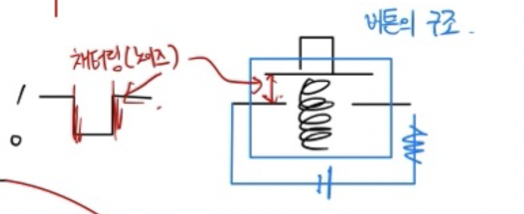
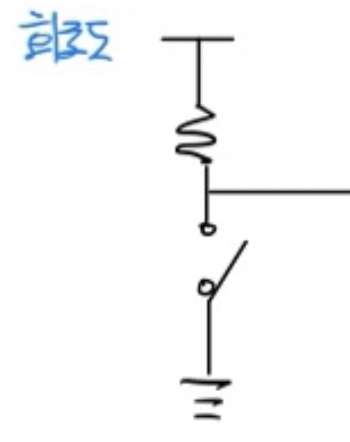
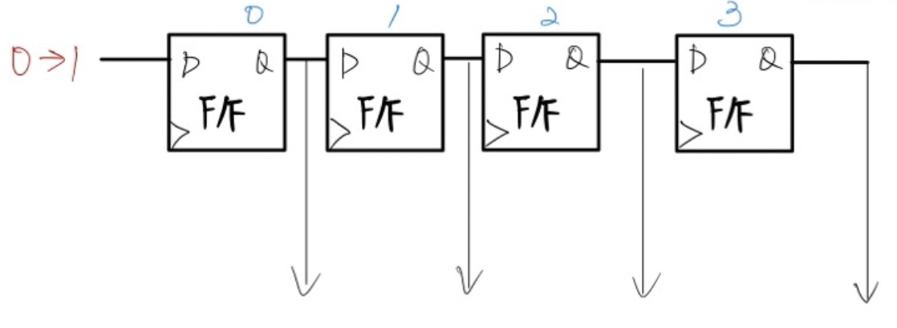
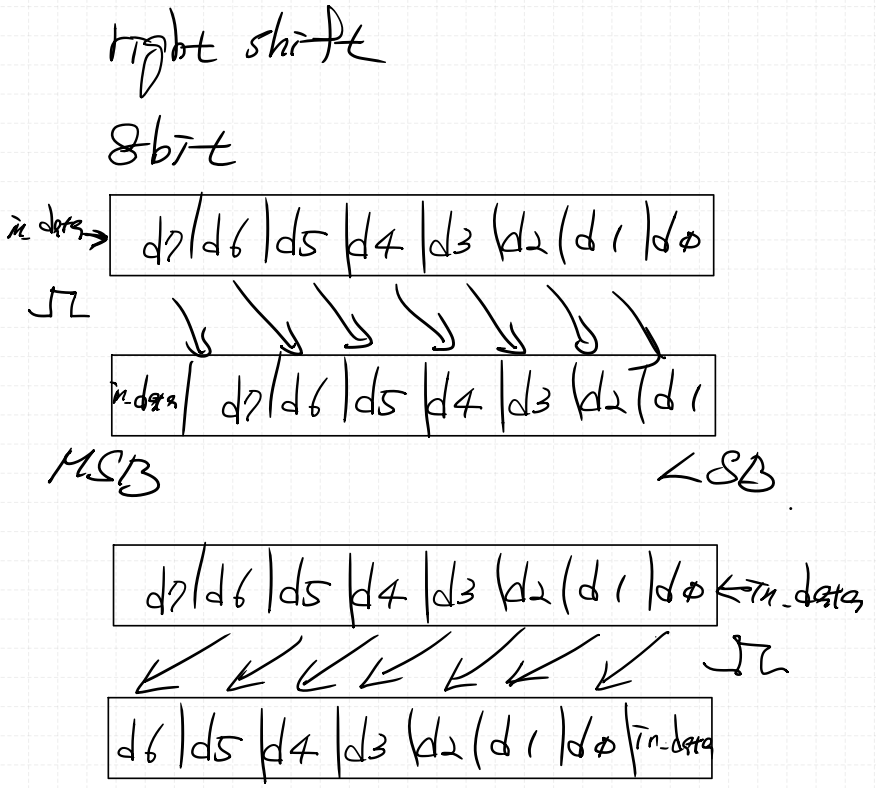
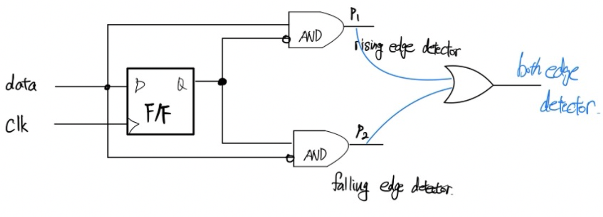
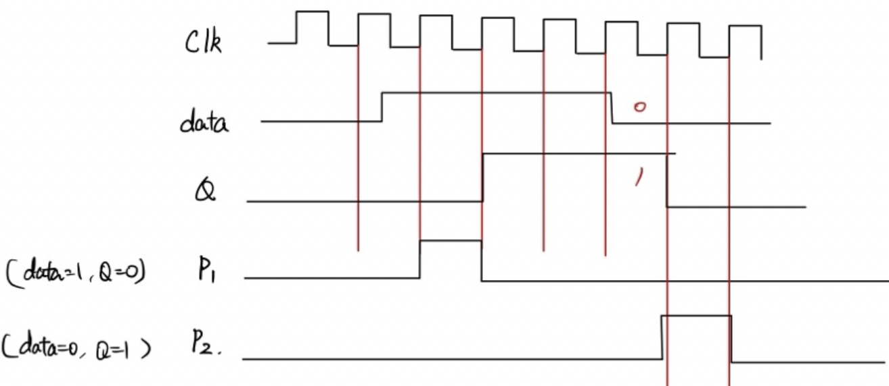
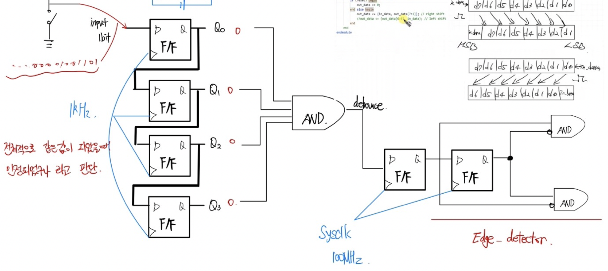

# DAY2

---

## ✅ 버튼 구조

  


- 버튼을 누를 때, **노이즈나 진동에 의해 짧은 시간 내에 ON/OFF가 반복됨**  
- 이 현상을 **바운스(Bounce)** 라고 하며, **디바운싱(Debounce)** 처리가 필요

---

## ✅ Shift Register를 이용한 디바운싱

  


### 💡 Shift Register 역할
- 버튼 입력(`in_data`)을 8클럭 동안 시프트 저장  
- `sh_reg` 값이 전부 1이면, **버튼이 안정적으로 눌림 상태**라고 판단

---

### ✅ shift_register 모듈 코드

```sv

module shift_register (
    input  logic       clk,
    input  logic       reset,
    input  logic       in_data,
    output logic [7:0] out_data
);

always_ff @(posedge clk or posedge reset) begin
    if(reset) begin
        out_data <= 0;
    end  
    else begin
        out_data <= {in_data, out_data[7:1]};     // right shift
        //out_data <= {out_data[6:0], in_data};   // left shift
    end   
end

endmodule
```

## ✅ 엣지 검출기 (Edge Detector)

  


### 🔍 개요
- **디바운싱된 버튼 입력(`debounce`)**의 변화를 감지하여  
  - 상승 엣지(`rising_edge`)  
  - 하강 엣지(`falling_edge`)  
  - 또는 둘 다(`both_edge`)를 검출하는 회로

---

### ✅ 동작 원리

```text
edge_reg[1] ← 이전 상태  
edge_reg[0] ← 현재 상태  

변화 조건  
- 상승 엣지: 이전 0 → 현재 1  
- 하강 엣지: 이전 1 → 현재 0  
- 둘 다: 둘 중 하나라도 발생 시  
```

```sv

assign debounce = &sh_reg;
    //assign out_button = debounce;

    logic [1:0] edge_reg;

    always_ff @(posedge clk or posedge reset) begin
        if(reset) begin
            edge_reg <= 0;
        end
        else begin
            edge_reg[0] <= debounce;
            edge_reg[1] <= edge_reg[0];
        end
    end

    assign rising_edge = edge_reg[0] & ~edge_reg[1];
    assign falling_edge = ~edge_reg[0] & edge_reg[1];
    assign both_edge = rising_edge | falling_edge;
```

## ✅ 전체 구조 (Button Detector)



```sv

`timescale 1ns / 1ps

module button_detector(
    input  logic clk,
    input  logic reset,
    input  logic in_button,
    output logic rising_edge,
    output logic falling_edge,
    output logic both_edge
    );

    logic clk_1khz;
    logic debounce;
    logic [7:0] sh_reg;
    logic [$clog2(100000)-1:0] div_counter;

    always_ff @(posedge clk or posedge reset) begin
        if(reset)begin
            div_counter <= 0;
            clk_1khz <= 0;
        end
        else begin
            if(div_counter == 100000 - 1)begin
                clk_1khz <= 1;
                div_counter <= 0;
            end
            else begin
                div_counter <= div_counter + 1;
                clk_1khz <= 0;
            end
        end
    end
    
    shift_register u_shift_register(
        .clk        (clk_1khz),
        .reset      (reset),
        .in_data    (in_button),
        .out_data   (sh_reg)
    );

    assign debounce = &sh_reg;
    //assign out_button = debounce;

    logic [1:0] edge_reg;

    always_ff @(posedge clk or posedge reset) begin
        if(reset) begin
            edge_reg <= 0;
        end
        else begin
            edge_reg[0] <= debounce;
            edge_reg[1] <= edge_reg[0];
        end
    end

    assign rising_edge = edge_reg[0] & ~edge_reg[1];
    assign falling_edge = ~edge_reg[0] & edge_reg[1];
    assign both_edge = rising_edge | falling_edge;

endmodule

module shift_register (
    input  logic       clk,
    input  logic       reset,
    input  logic       in_data,
    output logic [7:0] out_data
);

always_ff @(posedge clk or posedge reset) begin
    if(reset) begin
        out_data <= 0;
    end  
    else begin
        out_data <= {in_data, out_data[7:1]};     // right shift
        //out_data <= {out_data[6:0], in_data};   // left shift
    end   
end
    
endmodule
```

## ✅ 검증 (Test Bench)

```sv

```
