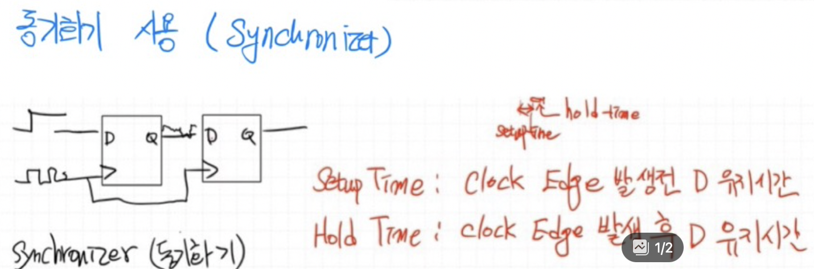

# DAY2

---

## ✅ 조합논리회로 vs 순차논리회로

| 항목             | 조합논리회로                                  | 순차논리회로                                   |
|------------------|-----------------------------------------------|-----------------------------------------------|
| 동작 기준        | 현재 입력에만 의존                            | 현재 입력 + 과거 상태(레지스터 등)             |
| 클록 사용 여부    | 클록 사용 안 함                               | 클록 사용 (동기식 설계)                         |
| 메모리 기능       | 없음                                          | 있음 (상태 저장 가능)                          |
| 예시             | AND, OR, MUX 등                               | FSM, 레지스터, 카운터, 메모리 등               |

> 💡 조합 논리는 빠르지만 타이밍 제어가 어렵고 글리치(glitch) 발생 가능성 있음.  
> 💡 순차 논리는 동기식으로 안정적이고 제어가 쉬움.

---

## ✅ Latch 와 Flip-Flop

- **Latch**
  - 클록 신호 없이 동작
  - 입력 신호에 민감하게 반응
  - 메모리 기능 있음

- **Flip-Flop**
  - 클록 엣지(상승/하강)에 반응
  - 엣지 트리거 방식으로 동작
  - 더 안정적인 메모리 소자

---

## ✅ SR Latch

- `Q`와 `/Q`는 항상 반대여야 함.
- 상태 설명:

| S | R | Q(next) | 설명         |
|---|---|---------|--------------|
| 0 | 0 | 유지     | 이전 상태 유지 |
| 0 | 1 | 0       | Reset 상태    |
| 1 | 0 | 1       | Set 상태      |
| 1 | 1 | 불안정  | 금지 상태 (발진 가능) |

---

## ✅ D Latch

- 입력을 단일화하여 S= D, R = D' 형태로 구성
- Gate 신호가 enable 역할
- 클록에 민감 (레벨 트리거 방식)

---

## ✅ Gated D Latch & D Flip-Flop

  

- **Gated D Latch**: Gate 신호가 high일 때만 입력 허용
- **D Flip-Flop (Master-Slave 구조)**
  - Master: 클록 Low일 때 입력 저장
  - Slave: 클록 High일 때 출력 전달
  - 상승엣지 또는 하강엣지에서만 출력 변화 (엣지 트리거)

---

## ✅ 메타스테이블(Metastable)

- 클록 엣지 시점에 입력(D)이 변하면 출력이 일정 시간 동안 **불안정 상태**에 빠질 수 있음
- 이를 **메타스테이블 현상**이라 함

### 중요 Timing Spec

| 항목         | 설명 |
|--------------|------|
| Setup Time   | 클록 엣지 이전에 D 입력이 안정적으로 유지되어야 하는 최소 시간 |
| Hold Time    | 클록 엣지 이후에도 D 입력이 유지되어야 하는 최소 시간 |

---

## ✅ Synchronizer

- 비동기 입력을 동기화하는 구조
- D Flip-Flop 2개 이상 직렬 연결
  - 첫 번째 F/F: 신호 수신
  - 두 번째 F/F: 안정된 출력 생성
- 메타스테이블 방지를 위한 대표적 설계 기법

---

## ✅ 전파 지연 시간 (Propagation Delay)

  

- 클록 → 출력까지 걸리는 시간
- 조합 회로의 깊이에 비례
- 예: 곱셈 연산이 많은 FFT 회로는 레지스터 삽입 필요

> 📌 데이터시트에서는 `clock-to-Q delay`, `t_pd`, `t_co` 등으로 명시됨

---

## ✅ 글리치(Glitch)

- 조합 논리에서 입력이 동시에 변하지 않으면, 전파 지연 차이로 인해 일시적인 오류 출력 발생 가능
- 클록 엣지 직전 글리치 발생 시 시스템 오동작 가능성 있음
- → 복잡한 조합 논리는 피하고, 순차 회로로 나누어 설계하는 것이 안전함

---

## ✅ 파이프라이닝 기법

- 연산 중간에 **레지스터 삽입**으로 클록 주기를 분할
- 복잡한 연산을 여러 클록 사이클에 나누어 처리 가능
- 조합 논리 길이를 줄여 글리치 방지 및 클록 여유 확보

---

## ✅ AMBA APB 예시

- AMBA APB 프로토콜도 메타스테이블과 클록 도메인 이슈를 고려하여 설계됨
- 동기화 구조 반영 필요

---

## ✅ 보완 및 추가 설명

- **타이밍 분석**은 FPGA/ASIC 설계의 핵심
  - Setup/Hold violation은 기능적 문제 유발
- **CDC (Clock Domain Crossing)** 설계에서는 synchronizer 필수
- **글리치**를 줄이기 위한 방법
  - 입력 신호 동기화
  - 레지스터 삽입 (타이밍 여유 확보)
- **순차 논리 설계에서의 핵심 원칙**
  - 항상 클록 경계 기준으로 상태 변화 설계
  - 조합 논리는 최소화

---

- **타이밍 분석은 FPGA/ASIC 설계의 핵심 요소**
  - `Setup` / `Hold` 타이밍 위반이 발생하면 회로 동작이 **비정상적**으로 될 수 있음
  - 타이밍 제약 조건을 만족하도록 설계하고, STA(Static Timing Analysis) 필수 수행

- **CDC (Clock Domain Crossing) 설계**
  - 서로 다른 클록 도메인을 오갈 때 **메타스테이블 위험**
  - 해결 방법:
    - 2단 이상 D Flip-Flop 직렬 연결 (Synchronizer)
    - Handshake 또는 FIFO 구조 사용

- **글리치(Glitch) 줄이기 위한 방법**
  - 입력 신호는 반드시 클록 도메인에 동기화
  - 조합 논리 길이가 길 경우 중간에 **레지스터 삽입**하여 안정화
  - 하나의 클록 사이클 내에 연산이 끝나도록 설계

- **순차 논리 설계 핵심 원칙**
  - 모든 상태 변화는 **클록 엣지 기준**으로 결정되어야 함
  - 조합 논리는 최소화하여 타이밍 복잡도를 줄이고, 유지/확장 가능한 설계 지향
