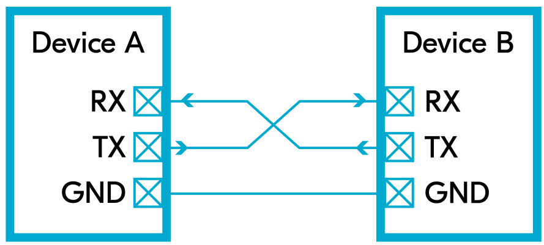
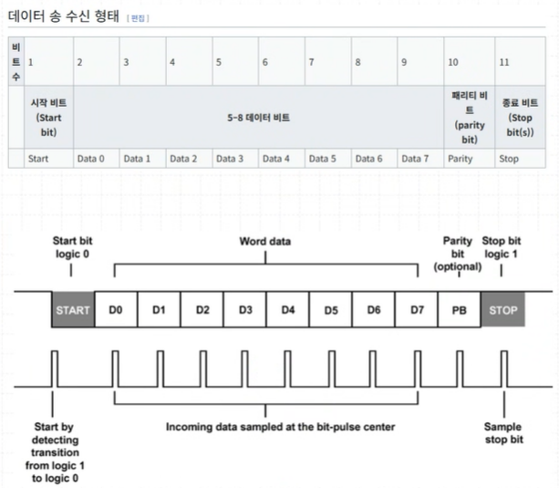
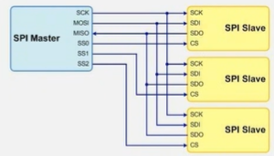

# DAY3

---

## ✅ UART (Universal Asynchronous Receiver/Transmitter)

### 1. 비동기 통신의 정의
- **동기(Synchronous)**  
  - 송수신 장치가 동일한 **클록 신호**를 공유  
  - 데이터와 클록이 함께 전송됨  
  - 예: SPI, I2C
- **비동기(Asynchronous)**  
  - 송수신 장치가 **클록 신호를 공유하지 않음**  
  - 각자 내부 타이머로 비트 타이밍을 맞춤  
  - 예: UART

---

### 2. UART가 비동기인 이유
1. **클록 라인이 없음**  
   - UART는 `TX`와 `RX` 두 선만 사용  
   - `클록 신호` 없이 데이터만 전송
2. **Start/Stop 비트로 동기화**  
   - 데이터 프레임 시작: **Start bit(0)**  
   - 데이터 프레임 종료: **Stop bit(1)**  
   - 수신 측은 Start bit 감지 후 내부 타이머로 비트 샘플링
3. **Baud Rate로 시간 동기화**  
   - 정해놓은 `시간`마다 데이터를 주고 받음
   - 송신 측과 수신 측이 동일한 baud rate로 약속  
   - 클록이 없으므로, 오차 범위 내에서만 정상 수신 가능

---

### 3. 동작 원리
1. **Idle 상태**
   - 라인은 기본적으로 HIGH(1) 상태
2. **Start Bit**
   - 통신 시작 시 1비트 길이의 LOW(0) 신호 전송
3. **Data Bits**
   - LSB부터 순차적으로 전송 (일반적으로 8비트)
4. **Parity Bit (옵션)**
   - 데이터 전송 중 오류 검출용 (Even, Odd)
   - 데이터의 1의 개수가 짝수, 홀수에 맞춰서 동작
   - 안 쓰는 이유는❓   
5. **Stop Bit**
   - 1비트 길이의 HIGH(1) 신호로 전송 종료 표시
6. **수신 측**
   - 스타트 비트를 감지 후 정해진 baud rate에 맞춰 비트 샘플링
7. **Frame**
   - 1~5번까지의 과정을 1프레임 

## ✅ SPI (Universal Asynchronous Receiver/Transmitter)

## 8. 비교 (UART vs SPI vs I2C)

| 구분   | UART          | SPI                | I2C                   |
|--------|--------------|--------------------|-----------------------|
| 동기방식 | 비동기         | 동기               | 동기                  |
| 관계 수 | 1:1         | 1:N               | N:N                  |
| 선 개수 | 2개 (TX, RX) | 4개 (MISO, MOSI, SCK, CS) | 2개 (SCL, SDA)       |
| 속도   | 중간 (bps~Mbps) | 매우 빠름 (수십 Mbps) | 중간 (100k~3.4Mbps)   |
| 장점   | 간단, 저전력   | 빠름, 풀듀플렉스    | 다중 장치 연결 용이    |