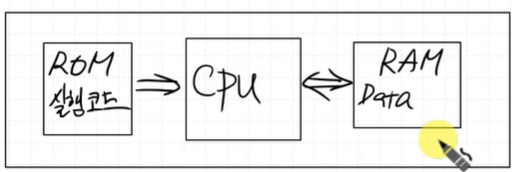

# DAY4
- CPU(Central Processing Unit) 중앙처리장치
---

## ✅ CISC vs RISC

- **CISC vs RISC**
   - CISC(Complex Instruction Set Computer)
   - RISC(Reduced Instruction Set Computer)

| 특징 (Feature) | RISC (축소 명령어 집합 컴퓨터) | CISC (복잡 명령어 집합 컴퓨터) |
| :--- | :--- | :--- |
| **명령어** | 적고 단순, 길이가 **고정** | 많고 복잡, 길이가 **가변적** |
| **실행 속도 (CPI)** | 한 클럭에 한 명령어 처리를 지향 (CPI ≈ 1) | 한 명령어가 여러 클럭을 소모 (CPI > 1) |
| **설계 복잡성** | 하드웨어는 단순, 소프트웨어(컴파일러)가 복잡 | 하드웨어가 복잡, 소프트웨어(컴파일러)는 단순 |
| **메모리 접근** | `LOAD`, `STORE` 등 전용 명령어로만 접근 | 다양한 명령어가 직접 메모리에 접근 가능 |
| **레지스터** | 범용 레지스터가 **많고** 활용도 높음 | 범용 레지스터 수가 비교적 **적음** |
| **파이프라이닝** | 구조가 단순하여 파이프라이닝에 **매우 효율적** | 명령어가 복잡하고 길이가 달라 파이프라이닝이 **복잡함** |
| **전력 소비** | 일반적으로 전력 소비가 **적음** | 일반적으로 전력 소비가 **많음** |
| **가격** | CISC보다 가격이 **저렴** | 트랜지스터가 많이 들어가기 때문에 가격이 **비쌈** |

- **MIPS(Microprocessor without Interlocked Pipeline Stages)**
   - 파이프라인 기술을 효율적으로 사용해 프로세서의 성능을 높이는 데에 초점을 맞춘 설계 방식
   - 고정 길이의 단순한 명령어
   - 파이프라인(Pipelining) 최적화
      - 파이프라인은 명령어 처리 과정을 '명령어 인출(IF) → 해석(ID) → 실행(EX) → 메모리 접근(MEM) → 결과 저장(WB)'의 5단계   
   - 로드-스토어 (Load-Store) 구조
   - 많은 수의 범용 레지스터

---

## ✅ 폰노이만 구조 vs 하버드 구조


- 폰노이만 구조




- 하버드 구조 

---

## ✅ RISC-V

- UC 버클리에서 개발중인 무료 오픈 소스 RISC 명령어셋 아키텍처
- MIPS 구조와 거의 비슷하다.

## ✅ 목표

- 1. Single Cycle Processor
  - 모든 명령어가 1clock 내에 실행 
- 2. Multi Cycle Processor
  - 명령어 종류에 따라 실행 clock수가 다르다.
- 3. pipe-line 구조 CPU

---

## ✅ Dedicated Processor

- 0~9까지 카운트하는 Processor를 설계하시오. 

```c
// C언어 관점
A = 0;
while (A < 10){
   output = A;
   A = A + 1;
}
halt;
```