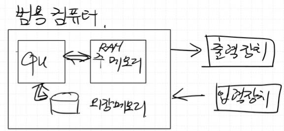
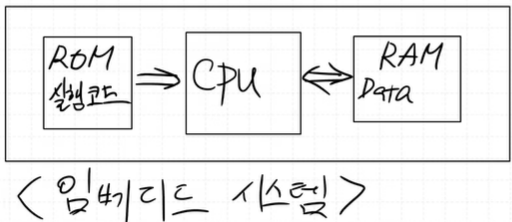

# DAY4
- CPU(Central Processing Unit) 중앙처리장치
---

## ✅ CISC vs RISC

- **CISC vs RISC**
   - CISC(Complex Instruction Set Computer)
   - RISC(Reduced Instruction Set Computer)

| 특징 (Feature) | RISC (축소 명령어 집합 컴퓨터) | CISC (복잡 명령어 집합 컴퓨터) |
| :--- | :--- | :--- |
| **명령어** | 적고 단순, 길이가 **고정** | 많고 복잡, 길이가 **가변적** |
| **실행 속도 (CPI)** | 한 클럭에 한 명령어 처리를 지향 (CPI ≈ 1) | 한 명령어가 여러 클럭을 소모 (CPI > 1) |
| **설계 복잡성** | 하드웨어는 단순, 소프트웨어(컴파일러)가 복잡 | 하드웨어가 복잡, 소프트웨어(컴파일러)는 단순 |
| **메모리 접근** | `LOAD`, `STORE` 등 전용 명령어로만 접근 | 다양한 명령어가 직접 메모리에 접근 가능 |
| **레지스터** | 범용 레지스터가 **많고** 활용도 높음 | 범용 레지스터 수가 비교적 **적음** |
| **파이프라이닝** | 구조가 단순하여 파이프라이닝에 **매우 효율적** | 명령어가 복잡하고 길이가 달라 파이프라이닝이 **복잡함** |
| **전력 소비** | 일반적으로 전력 소비가 **적음** | 일반적으로 전력 소비가 **많음** |
| **가격** | CISC보다 가격이 **저렴** | 트랜지스터가 많이 들어가기 때문에 가격이 **비쌈** |

- **MIPS(Microprocessor without Interlocked Pipeline Stages)**
   - 파이프라인 기술을 효율적으로 사용해 프로세서의 성능을 높이는 데에 초점을 맞춘 설계 방식
   - 고정 길이의 단순한 명령어
   - 파이프라인(Pipelining) 최적화
      - 파이프라인은 명령어 처리 과정을 '명령어 인출(IF) → 해석(ID) → 실행(EX) → 메모리 접근(MEM) → 결과 저장(WB)'의 5단계   
   - 로드-스토어 (Load-Store) 구조
   - 많은 수의 범용 레지스터

---

## ✅ 폰노이만 구조 vs 하버드 구조



- 폰노이만 구조




- 하버드 구조 

---

## ✅ RISC-V

- UC 버클리에서 개발중인 무료 오픈 소스 RISC 명령어셋 아키텍처
- MIPS 구조와 거의 비슷하다.

## ✅ 목표

- 1. Single Cycle Processor
  - 모든 명령어가 1clock 내에 실행 
- 2. Multi Cycle Processor
  - 명령어 종류에 따라 실행 clock수가 다르다.
- 3. pipe-line 구조 CPU

---

## ✅ Dedicated Processor

- 0~9까지 카운트하는 Processor를 설계하시오. 

```c
// C언어 관점
A = 0;
while (A < 10){
   output = A;
   A = A + 1;
}
halt;
// A를 중심에 놓고 생각
// A를 하드웨어적으로 구현한다 생각하면 -> A 레지스터
```

| Block Diagram | State Machine |
| :---: | :---: |
|  |  |


- 0~10까지 누적으로 더하는 Dedicated Processor를 설계하시오.

#### **C 구현**

```c
// C언어 관점
A = 0;
SUM = 0;
while (A < 11){
   SUM = SUM + A;
   A = A + 1;
   output = SUM;
}
halt;
```

#### **DataPath 구조 설계**


---

#### **ASM chart -> Control Unit 설계**


  - top 
  - 코드, 시뮬레이션, fnd 숫자 출력, 동작영상

### **코드**
---
#### DedicatedProcessor_Adder.sv

```verilog
module DedicatedProcessor_Adder(
    input  logic        clk,
    input  logic        reset,
    output logic [ 3:0] fndCom,
    output logic [ 7:0] fndFont
    );

    logic ASrcMuxsel, AdderSrcMuxsel, AEn, ALt11;
    logic [7:0] OutData;
    logic [$clog2(10_000_000)-1:0] div_counter;
    logic clk_10hz;

    always_ff @(posedge clk or posedge reset) begin
        if(reset) begin
            div_counter <= 0;
            clk_10hz <= 0;
        end
        else begin
            if(div_counter == 10_000_000 - 1) begin
                div_counter <= 0;
                clk_10hz <= 1;
            end
            else begin
                div_counter <= div_counter + 1;
                clk_10hz <= 0;
            end
        end
    end

    DataPath U_DataPath (
        .clk(clk_10hz),
        .*
    );

    ControlUnit U_ControlUnit (
        .clk(clk_10hz),
        .*
    );

    fndController U_fndController (
        .clk     (clk),
        .reset   (reset),
        .number  (OutData),        //14bit
        .fndCom  (fndCom),
        .fndFont (fndFont)
    );

    endmodule
```

---

#### DataPath.sv

```verilog
module DataPath(
        input  logic       clk,
        input  logic       reset,
        input  logic       ASrcMuxsel,
        input  logic       AEn,
        input  logic       AdderSrcMuxsel,
        output logic       ALt11,
        output logic [7:0] OutData
    );

    logic [7:0] AdderResult, ASrcMuxOut, SUMRegOut, ARegOut, SUMSrcMuxOut, A_SUM_Result;

    mux_2X1 U_MUX_A(
        .sel    (ASrcMuxsel),
        .x0     (8'b0), 
        .x1     (AdderResult),
        .y      (ASrcMuxOut)
    );

    mux_2X1 U_Mux_SUM (
        .sel    (ASrcMuxsel),
        .x0     (8'b0),
        .x1     (A_SUM_Result),
        .y      (SUMSrcMuxOut)
    );

    register U_A_REG (
        .clk    (clk),
        .reset  (reset),
        .en     (AEn),
        .d      (ASrcMuxOut),
        .q      (ARegOut)
    );

    register U_SUM_REG (
        .clk    (clk),
        .reset  (reset),
        .en     (AEn),
        .d      (SUMSrcMuxOut),
        .q      (SUMRegOut)
    );

    comparator U_ALt11 (
        .a      (ARegOut),
        .b      (8'd11),
        .lt     (ALt11)
    );

    adder U_Adder_A (
        .a      (ARegOut),
        .b      (8'b1),
        .sum    (AdderResult)
    );

    adder U_Adder_SUM (
        .a      (AdderResult),
        .b      (SUMRegOut),
        .sum    (A_SUM_Result)
    );

    register U_OUT_REG (
        .clk    (clk),
        .reset  (reset),
        .en     (AdderSrcMuxsel),
        .d      (SUMRegOut),
        .q      (OutData)
    );
    
    endmodule
```

---

#### ControlUnit.sv

```verilog
module ControlUnit(
    input  logic clk,
    input  logic reset,
    input  logic ALt11,
    output logic ASrcMuxsel,
    output logic AEn,
    output logic AdderSrcMuxsel   
    );

    typedef enum {
        S0,
        S1, 
        S2, 
        S3, 
        S4
    } state_e;

    state_e state, next_state;

    always_ff @(posedge clk or posedge reset) begin
        if(reset) begin
            state <= S0;
        end
        else begin
            state <= next_state;
        end
    end

    always_comb begin
        ASrcMuxsel      = 1'b0;
        AEn             = 1'b0;
        AdderSrcMuxsel  = 1'b0;
        next_state      = state;
        case (state)
            S0: begin
                ASrcMuxsel      = 1'b0;
                AEn             = 1'b1;
                AdderSrcMuxsel  = 1'b0;
                next_state      = S1;
            end
            S1: begin
                ASrcMuxsel      = 1'b1;
                AEn             = 1'b0;
                AdderSrcMuxsel  = 1'b0;
                if (ALt11)   next_state = S2;
                else         next_state = S4;
            end 
            S2: begin
                ASrcMuxsel      = 1'b1;
                AEn             = 1'b0;
                AdderSrcMuxsel  = 1'b1;
                next_state      = S3;
            end 
            S3: begin
                ASrcMuxsel      = 1'b1;
                AEn             = 1'b1;
                AdderSrcMuxsel  = 1'b0;
                next_state      = S1;
            end 
            S4: begin
                ASrcMuxsel      = 1'b1;
                AEn             = 1'b0;
                AdderSrcMuxsel  = 1'b0;
                next_state      = S4;
            end
        endcase
    end

    endmodule
```

---

#### TestBench

```verilog
`timescale 1ns / 1ps

module tb_DedicatedProcessor_Adder ();

    logic       clk;
    logic       reset;
    logic [3:0] fndCom;
    logic [7:0] fndFont;
    
    DedicatedProcessor_Adder U_DedicatedProcessor_Adder (.*);

    always #5 clk = ~clk;

    initial begin
        clk = 0;
        reset = 1;
        #10;
        reset = 0;
    end
    
endmodule
```

---
### **시뮬레이션**


---
### **동작 영상**
