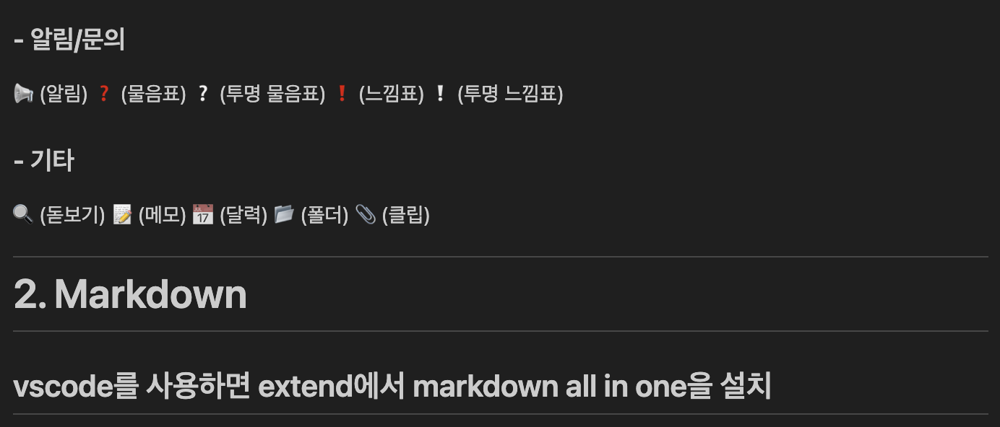

# Git Blog User Guide
- ## 1. 이모티콘<br>
- ## 2. 마크다운<br>
- ## 3. 홈페이지 꾸미기<br>
---
## <추가적으로 필요한 건 GPT 활용>
### - 핵심/중요 표시
📌 (핀)
🔑 (열쇠)
⭐ (별)
🚨 (비상)
💡 (아이디어)
### - 상태/진행
✅ (체크)
❌ (엑스)
🚧 (공사 중)
🚀 (성공/시작)
🔄 (반복/리로드)
### - 감정/피드백
😊 (웃는 얼굴)
👍 (좋아요)
👎 (싫어요)
🙏 (부탁/감사)
🎉 (축하)
### - 알림/문의
📢 (알림)
❓ (물음표)
❔ (투명 물음표)
❗ (느낌표)
❕ (투명 느낌표)
### - 기타
🔍 (돋보기)
📝 (메모)
📅 (달력)
📂 (폴더)
📎 (클립)

---

# 2. Markdown
vscode를 사용하면 extend에서 markdown all in one을 설치



- 
1.
- 1.
- ### 1 
- ### **글씨 굵게** vs 글씨 굵게
- ### 이런식으로 활용가능

###### 글씨 크기 - 몇개까지 되는 지는 모름
##### 글씨 크기
#### 글씨 크기
### 글씨 크기 
## 글씨 크기  - #2개부터는 밑줄이 생성된다.
# 글씨 크기 


## 코드 넣는 법
```py

```
```bash
# 가상 환경 생성 및 활성화
python3 -m venv .env        # 가상 환경 생성 (폴더 이름: .env)
source .env/bin/activate    # 가상 환경 활성화
```


