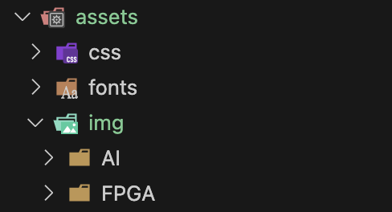

# Git Blog User Guide
- ### 1. 이모티콘<br>
- ### 2. 마크다운<br>
- ### 3. 홈페이지 꾸미기<br>
---

### 우선 매번 이 세줄을 적는 것이 귀찮기 때문에 


### - vi push -> (파일명)은 마음대로

```bash
git add .
git commit -m "update"
git push 
```

```bash
# 터미널에서 실행 파일로 변경하기
chmod 755 push
# ./push 하면 실행된다
```

### - git pull 도 마찬가지로 하면 된다.

## <추가적으로 필요한 건 GPT 활용>
### - 핵심/중요 표시
📌 (핀)
🔑 (열쇠)
⭐ (별)
🚨 (비상)
💡 (아이디어)
### - 상태/진행
✅ (체크)
❌ (엑스)
🚧 (공사 중)
🚀 (성공/시작)
🔄 (반복/리로드)
### - 감정/피드백
😊 (웃는 얼굴)
👍 (좋아요)
👎 (싫어요)
🙏 (부탁/감사)
🎉 (축하)
### - 알림/문의
📢 (알림)
❓ (물음표)
❔ (투명 물음표)
❗ (느낌표)
❕ (투명 느낌표)
### - 기타
🔍 (돋보기)
📝 (메모)
📅 (달력)
📂 (폴더)
📎 (클립)

---

# 2. Markdown
vscode를 사용하면 extend에서 markdown all in one을 설치 <br>
git push 하기 전에 markdown 으로 작성한 것을 미리 볼수 있다. 


- 
1.
- 1.
- ### 1 
- ### **글씨 굵게** vs 글씨 굵게
- ### 이런식으로 활용가능

###### 글씨 크기 - 몇개까지 되는 지는 모름
##### 글씨 크기
#### 글씨 크기
### 글씨 크기 
## 글씨 크기  - #2개부터는 밑줄이 생성된다.
# 글씨 크기 


## 코드 넣는 법
### - ```옆에 파일명 적지 않아도 되긴 한데 이런 차이가 있음
```py
import numpy
```

```
import numpy
```

```bash
# 가상 환경 생성 및 활성화
python3 -m venv .env        # 가상 환경 생성 (폴더 이름: .env)
source .env/bin/activate    # 가상 환경 활성화
```
---
## 이미지 파일 넣을 때 팁

### - 마크다운 형식에서는 이 방법이 적용가능

[dnjsdud] 

### ![alt text] 는 이미지 경로가 잘못되었을 경우 alt text문구가 업데이트 
### (file_path) 를 적어주면 된다 이 블로그 형식은 assets/img/ 인데 디렉토리마다 이미지를 정리해주는 것이 좋다
### [dnjsdud] 이 부분은 git blog 에서 이미지 위에 커서를 갖다대면 []안에 입력한 글씨가 보인다
### ❗ 이미지를 넣을때 그냥 위아래로는 한칸씩 비워둔다.
### ❗Tip 
- ### 이미지 파일을 markdown 코드 안으로 드래그 -> 원하는 라인에 커서 위치 -> shift 키 입력 후 drop 하면 아래와 같이 이미지가 불러와진다!  



### - 이미지 크기 조절하는 방법

### 마크다운에서도 이미지 크기가 조절가능하지만 이미 만들어진 형식 안을 수정하려면 파일을 찾아야함 -> 그래서 html 코드 방식을 활용하면 쉽게 바꿀 수 있음
---
### 예시

```
<style="width:75%; height:75%; object-fit:contain; border-radius:75%;">
```
### width는 가로 height은 세로 *object-fit:contain;* 이거 **꼭** 적어줘야함 
### border-radius:75%; 이거는 사진 원형으로 만든거임 

```

```

### style="width:25% !important; 이렇게 조건을 주면 가로 배율만 가능 12.5, 25, 50, 75, 100이렇게 가능하고 세로는 height=숫자값만; 이렇게도 넣어서 구현 가능함 (비 추천)

## 로딩 이미지 바꾸기


### - 위 사진에 있는 loading.html파일에 들어가서

```html
<div id="loading">
    <div class="loading_box">
        
        <p>Please wait ...</p>  /* 이미지 밑에 적을 내용 */
    </div>
</div>
```

### ❗Tip 
### 다크 모드일 때 loading 글씨 색을 바꾸고 싶다하면 


- ### loading p { color:#FFB6C1; }의 #FFB6C1 값을 바꿔주면 된다
- ### 추가적으로, 마우스 커서를 색 위에 갖다대면 색깔 바꿀 수 있음!
